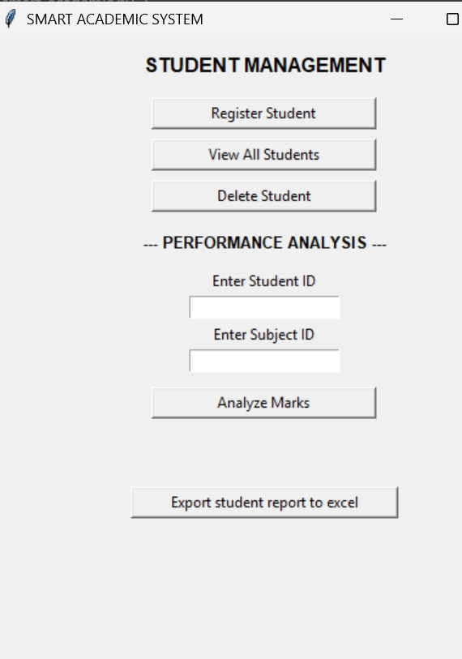

# Smart Academic System
## Project Brief
The Smart Academic System is a desktop application built with Python and Tkinter designed to modernize assessment analytics for educators. Teachers regularly collect large amounts of student performance data from assignments, tests, and examinations. However, traditional methods only analyze high-level metrics like total marks, mean scores, grades, and class positions, forcing teachers to perform tedious manual analysis that fails to reveal specific learning gaps.

This project addresses this challenge by allowing teachers to log student marks broken down by learning areas and specific sub-strands (topics). The system automatically analyzes these entry logs to generate meaningful, diagnostic performance reports highlighting poorly performed topics, overall subject trends, improved areas, and specific topics requiring remedial intervention.

## Business Rationale
In modern competency-based education, clarity and targeted feedback are essential. This application solves two primary operational challenges:

***Granular Diagnostic Analytics:*** Replaces high-level summaries with detailed, topic-level insights, helping teachers instantly identify individual and class-wide learning gaps without manual effort.

***Actionable Remediation Planning:*** Automatically flags sub-strands where learners fall below benchmarks, allowing educators to deploy immediate remedial interventions and track progress over time.

## Technologies used
***Python 3:*** Core programming language powering analytical calculations and database management.

***Tkinter:*** GUI toolkit providing a clean, accessible desktop interface for fast data entry.

***SQLite3:*** Relational database (student.db) for structured storage of student profiles, learning areas, and sub-strand marks.

***Pandas & OpenPyXL:*** Data analysis libraries used to format, structure, and export academic reports into clean .xlsx spreadsheets.

***Git/GitHub:*** Version control, collaboration, and repository hosting.

## Accessibility features
***Structured Form Inputs:*** Clear labeling for Student IDs, Subject IDs, and mark inputs to eliminate input ambiguity.

***High Contrast & Hierarchy:*** Clean typographic contrast ensuring easy readability during quick data entry sessions.

***Instant Alert Dialogs:*** Integrated messagebox alerts providing immediate feedback on successful record entries, validation errors, or missing data queries.

## Product features
The application delivers three core operational modules:

***Student & Subject Management:*** Dedicated windows to register new learners, query roster lists, and maintain subject/sub-strand definitions in the database.

***Sub-Strand Performance Analysis:*** Evaluates individual topic scores against defined criteria to flag poorly performed topics, improved areas, and sub-strands needing remedial support.

***Custom Excel Export:*** Generates formatted .xlsx academic reports displaying learner metadata and clean performance breakdown tables without redundant text repetition.

## Git workflow
Fork the Repository: Create your own copy of the project to work on.

**Create a Feature Branch:**

```Bash
git checkout -b YourFeatureName
Commit Your Changes

Push to branch:
```

```Bash
git push origin feature/YourFeatureName
```
Open a Pull Request (PR): Describe your changes clearly and link the related issues.


## Set up instructions
**Clone this repository on your local machine.**

```Bash
git clone https://github.com/rollingsmajiwa/python_end_module.git
cd python_end_module
```
**Ensure you have the required dependencies installed.**

```Bash
pip install pandas openpyxl
```
**Run the application executable script.**

```Bash
python smart_academic.py
```
## Screenshots


## Author
Rollings Majiwa

**GitHub:** [https://github.com/rollingsmajiwa](https://github.com/rollingsmajiwa)

**Email:** [rollingsmajiwa@gmail.com](rollingsmajiwa@gmail.com)

## Get started
Interested in the code behind Smart Academic System? You can reach me directly via my profile or open an issue for collaboration. [Visit my Github profile](https://github.com/rollingsmajiwa)